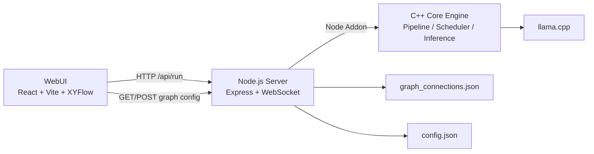

# AstraRP · 模块化角色扮演智能体流水线

<p align="center">
  
  
  
  
  
</p>

> **AstraRP** 是一个面向深度角色扮演（Role-Play）的“模型即算子”推理系统：将传统单体 LLM 的黑箱推理过程拆解为可观测、可替换、可编排的多节点流水线。

---

## ✨ 项目简介

AstraRP 基于 `llama.cpp` 的高性能推理能力，提供 **C++ 核心引擎 + Node.js 服务层 + React 可视化编排界面** 的完整方案：

- 将 RP 推理分解为格式化、推理、输出等节点，并通过有向图连接执行。
- 支持流式输出（NDJSON）、节点级日志广播（WebSocket）、图配置持久化。
- 支持通过原生 Node Addon 调用 C++ 引擎，在保持性能的同时具备工程可扩展性。

---

## 🚀 为什么开发这个项目（开发原因）

传统 RP 系统常见痛点：

- **黑箱严重**：角色行为出错时很难定位是“理解错误”还是“状态更新错误”。
- **成本偏高**：单体大模型在 CPU 或轻量环境下部署成本高、调优慢。
- **迭代受限**：想替换某个子能力（如意图识别）常常需要重训整套模型。

AstraRP 的目标是把“角色扮演能力”拆成可迭代的能力单元，让你可以像搭积木一样演化角色智能。

---

## 🧭 设计理念

1. **可解释优先**：每条边流转的数据可观测，便于定位问题与回放分析。
2. **模块化优先**：每个节点都是职责明确的算子，支持热替换与独立调优。
3. **工程化优先**：从 CMake 构建到 Node 服务，再到可视化前端，保障可落地。
4. **轻量部署优先**：面向 CPU 优化与小模型协同，追求性价比与可维护性。

---

## 🏗️ 项目架构



### 分层说明

- **WebUI 层**：可视化搭建节点图、查看日志、保存/加载图配置。
- **Server 层**：负责 API、流式响应、图配置管理、LoRA 上传、日志广播。
- **Core 层**：提供推理引擎、图调度器、节点执行模型与底层模型调用能力。

---

## 🗂️ 文件目录层次（精简版）

```text
AstraRP/
├─ core/                     # C++ 核心引擎
│  ├─ include/               # 头文件（core / infer / pipeline / utils）
│  ├─ src/                   # 实现代码
│  ├─ examples/              # 示例与验证程序
│  ├─ CMakeLists.txt         # 核心构建配置
│  └─ binding.cpp            # Node Addon 绑定
├─ scripts/
│  ├─ setup.js               # 初始化开发环境
│  ├─ build.js               # 一键构建 core + addon
│  └─ debug_token_routing_and_infer_guard.js
├─ webui/                    # 前端可视化编排界面
│  ├─ src/components/        # 侧边栏、日志等组件
│  ├─ src/nodes/             # 各类可拖拽节点
│  ├─ src/edges/             # 自定义边
│  └─ src/store/             # Zustand 状态管理
├─ server.js                 # Node 服务入口
├─ config.json               # 全局推理/图配置
├─ graph_connections.json    # 默认图连接配置
└─ package.json              # 根脚本与依赖
```

---

## 🧪 使用方法（Quick Start）

### 1) 环境准备

- Node.js 18+
- CMake 3.18+
- 可用 C++20 编译器（GCC/Clang/MSVC）
- Git（用于子模块拉取）

### 2) 初始化项目

```bash
git clone https://github.com/pjh456/AstraRP.git
cd AstraRP
npm run setup
```

### 3) 构建原生引擎与 Node Addon

```bash
npm run build
```

### 4) 启动服务

```bash
node server.js
```

### 5) 启动 WebUI（另开终端）

```bash
cd webui
npm install
npm run dev
```

---

## 📜 npm run 可执行脚本

### 根目录脚本（`/package.json`）

| 脚本 | 命令 | 作用 |
|---|---|---|
| `npm run setup` | `node scripts/setup.js` | 同步子模块、安装依赖、清理旧 `binding.gyp` |
| `npm run build` | `node scripts/build.js` | 编译 C++ core、自动生成 `binding.gyp` 并构建 addon |
| `npm test` | `echo "Error: no test specified" && exit 1` | 预留测试脚本（当前未实现） |

### WebUI 脚本（`/webui/package.json`）

| 脚本 | 命令 | 作用 |
|---|---|---|
| `npm run dev` | `vite` | 启动前端开发服务器 |
| `npm run build` | `tsc -b && vite build` | TypeScript 构建 + 前端打包 |
| `npm run lint` | `eslint .` | 代码规范检查 |
| `npm run preview` | `vite preview` | 预览打包产物 |

---

## 🔧 构建方案（Build Strategy）

AstraRP 采用“两段式构建”：

1. **C++ 核心构建**（CMake）
   - 在 `core/` 下编译 `astrarp_lib` 与相关依赖。
   - 关闭不必要的示例/测试目标以提升构建效率。
   - 默认开启优化选项（如 `-O2`, `-march=native`）。

2. **Node Addon 构建**（node-gyp）
   - `scripts/build.js` 自动扫描 core 构建产物并生成 `binding.gyp`。
   - 通过 `node-gyp configure/build` 生成 `astrarp_node.node`。
   - 将动态库复制到 `build/Release`，保障运行时可加载。

---

## 🧱 技术栈选择

- **推理核心**：C++20 + `llama.cpp`
  - 原因：高性能、可控内存与线程模型，适合精细化推理管线。
- **服务中台**：Node.js + Express + WebSocket
  - 原因：接口开发效率高，便于流式协议与前端联动。
- **可视化前端**：React + TypeScript + Vite + XYFlow + Zustand
  - 原因：组件化与类型安全并重，适合构建可拖拽图编辑器。
- **构建体系**：CMake + node-gyp
  - 原因：跨平台 C++ 构建 + Node 原生扩展生态成熟。

---

## ⚙️ 图连接配置（Graph Connection Config）

`config.json` 中可通过 `graph_connection` 管理图配置行为：

```json
"graph_connection": {
  "enabled": true,
  "path": "./graph_connections.json",
  "auto_build_backend": true,
  "auto_load_frontend": false,
  "allow_frontend_save": true
}
```

- `auto_build_backend`：当前端未传图时，后端自动读取本地图并执行。
- `auto_load_frontend`：WebUI 启动时自动加载并还原图。
- `allow_frontend_save`：允许前端直接保存图到配置文件。

---

## 🛣️ Roadmap

- [ ] 完善各层节点模板与配置面板（格式化/推理/输出）
- [ ] 增加更多节点类型（检索、记忆、角色状态更新）
- [ ] 支持更完整的运行分析与链路追踪
- [ ] 打通模型节点分享与社区生态

---

## 🤝 贡献

欢迎提 Issue / PR，一起把 RP 智能体工程做得更透明、更可控、更可复现。

